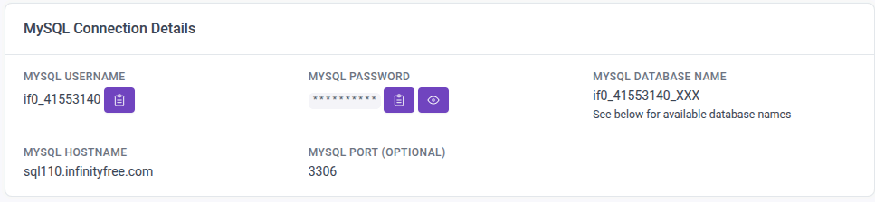
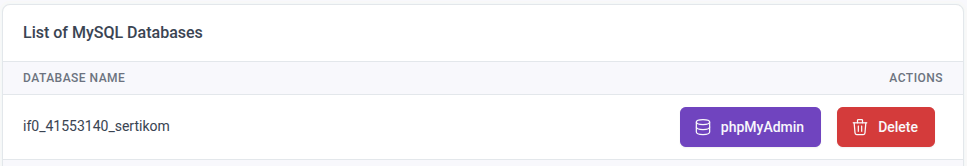

# YASP
YASP (Yet Another Sertikom Project) adalah project untuk syarat lulus dan kompeten dalam skema Junior Web Development (JWD).

## Cara menggunakan project ini

1. Copy dan paste file `.env.example` lalu ubah namanya menjadi `.env` dan sesuaikan:

- DB_HOST
- DB_NAME
- DB_USER
- DB_PASS
- DB_PORT

2. Buatlah database bernama `sertikom` lalu import file sql pada folder `docker/db/init-db.sql`

3. Semua Routing (GET, POST, PUT, DELETE) akan ditambah ke dalam file `public/index.php`

4. Untuk membuat tampilan, anda bisa membuat di dalam folder `app/views/`

5. Ubah `app/layouts/layout.php` seperlunya

6. Ketika ingin membuat controller, anda bisa membuat nya di dalam folder `app/controllers/`

## Cara hosting project

1. Pergi ke `https://www.infinityfree.com/`

2. Register akun (kalau sudah punya akun bisa langsung login)

3. Buat akun hosting dan pilih hosting plan "INFINITY FREE" 

4. Lalu anda bikin subdomain, contoh:
`crunkxsertikomx`.
Setelah nya anda bisa memilih Domain extension tersedia.

5. Anda akan mengupload semua folder project anda ke dalam infinityfree, maka buka file manager lalu upload project anda ke dalam folder `htdocs`

**File yang tidak perlu seharusnya anda upload:**

- docker/ 
- gitignore
- compose.yaml
- Dockerfile

6. Pindah file `htdocs/public/index.php` ke luar `htdocs/index.php`

7. Buatlah database dengan nama database yang sudah anda buat sebelumnya, lalu import file sql `init-db.sql`.

8. Setelah membuat database, anda akan kembali ke file manager masuk ke dalam file .env dan sesuaikan:

- DB_HOST
- DB_NAME
- DB_USER
- DB_PASS
- DB_PORT

dengan MySQL Connection Details dan List of MySQL Databases milik infinityfree.com

Contoh:

